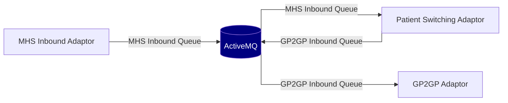

# Operating The Patient Switching Adaptor

## Dependencies

To run the adaptor you will need:

- Both the [nia-ps-adaptor (aka translator)][nia-ps-adaptor] and [nia-ps-facade] containers running
- A populated PostgreSQL DB, for more details see [Database Requirements](#database-requirements)
- A [message broker](#message-broker)
- An instance of the [MHS Adaptor] running

[nia-ps-facade]: https://hub.docker.com/r/nhsdev/nia-ps-facade
[nia-ps-adaptor]: https://hub.docker.com/r/nhsdev/nia-ps-adaptor
[MHS Adaptor]: https://github.com/NHSDigital/integration-adaptor-mhs/

## Logging and tracing

The Patient Switching Adaptors services emit logs which are captured by the docker containers they are hosted within. Whichever Docker container orchestration technology is used, the log streams can be captured and forwarded to an appropriate log indexing service for consumption, storage and subsequent queries. 

The consumption of these logs form an essential part of issue investigation and resolution. 

The log messages relating to a specific transfer can be identified by the Conversation ID. Which is a correlating ID present throughout the patient record migration and carried in the GP2GP messages themselves.

### Resources allocation
Based on the use cases outlined in [Performance](README.md#Performance), 
allocating 2 vCPUs and 4 GB RAM to the PS Adaptor components (Facade and Translator) is a solid starting point 
and can be considered a moderate resource allocation. 
However, if the system encounters performance challenges under higher concurrency or larger file sizes, 
vertical scaling may be required. If performance degradation is observed, consider increasing the allocation to 4 vCPUs 
and 8 GB RAM for both the Facade and Translator.

### Log message format

```text
yyyy-mm-dd HH:mm:ss.SSS Level=DEBUG Logger=u.n.a.p.t.s.BundleMapperService ConversationId=6836FD37-B856-4167-A087-7E3989020FA3 Thread="org.springframework.jms.JmsListenerEndpointContainer#0-1" Message="Mapped Bundle with [261] entries"
```
- Level: The logging level of the message (INFO/DEBUG/WARN/ERROR) 
- Logger: The name of the Java class that emitted the message
- ConversationId: The ID correlating all messages for a patient transfer
- Message: The log message 

## Timeout functionality

The Adaptor conforms to the GP2GP specification by timing out in-progress transfers. This ensures transfers are ended 
gracefully in the scenario a GP2GP message has not been received.

The timeout datetime is calculated using the following formula:

```text
Timeout [secs] = (A x persistDuration contract property of EHR Response [secs])
               + (B x Number of COPC Common Point to Point EHR messages
                    x persistDuration contract property of COPC Common Point to Point messages [secs])
```

The formula includes adjustable weightings (A and B) to offset potential transmission delays. 

From the documentation:

> A & B are weighting factors associated with general message transmission delays and volume based
throughput times to allow adjustment if required ....

The *Persist Duration* of each message is unique to the sending organisation and is obtained from the [Spine Directory Service (SDS) FHIR API](https://digital.nhs.uk/developer/api-catalogue/spine-directory-service-fhir). Responses for an organisation's message type are cached by default, the frequency the cache is
updated is configurable via the environment variable `TIMEOUT_SDS_POLL_FREQUENCY`. 

The adaptor checks incomplete transfers periodically, at a default frequency of every six hours. However, this is configurable via the environment variable `TIMEOUT_CRON_TIME`.

For more configuration see the [Migration timeout variables](#migration-timeout-variables) section.

## Dependent Service Downtime and PS Adaptor Behavior
This section highlights the specific focus on the dependent services and how the PS Adaptor operates when those services are unavailable.
[PS Adaptor User Guide: Service Failures and Expected Behavior](./dependent-service-downtime-and-ps-adaptor-behavior.md)

## Database requirements

* The adaptor requires a [PostgreSQL] database
* The adaptor stores the identifiers, status, and metadata for each patient transfer
* The adaptor uses the database as a source of SNOMED information
* Deleting the database, or its records will cause any in-progress transfers to fail
* In addition to the [/Patient/$gpc.migratestructuredrecord][migratestructuredrecord] endpoint, the database can be used to monitor for any failed or incomplete transfers

[PostgreSQL]: https://www.postgresql.org/
[migratestructuredrecord]: README.md#patientgpcmigratestructuredrecord

### Updating the application schema

The adaptor uses Liquibase to perform DB migrations.
New versions of the Adaptor may require DB changes, which will necessitate the execution of the migration script before the new version of the application can be executed.

The DB migrations is build as a Docker image, hosted on DockerHub under [nhsdev/nia-ps-db-migration](https://hub.docker.com/r/nhsdev/nia-ps-db-migration).

Required environment variables:

- POSTGRES_PASSWORD e.g. super5ecret
- PS_DB_OWNER_NAME e.g. postgres
- PS_DB_URL e.g. jdbc:postgresql://hostname:port
- GPC_FACADE_USER_DB_PASSWORD e.g. another5ecret, used when creating the user `gpc_user`
- GP2GP_TRANSLATOR_USER_DB_PASSWORD e.g. yetanother5ecret, used when creating the user `gp2gp_user`

*When passing passwords into this script it is the responsibility of the supplier to ensure that passwords are being kept secure by using appropriate controls within their infrastructure.*

### Populating the SNOMED database

The adaptor requires an up to date copy of the SNOMED DB as part of translating FHIR `CodableConcepts`.

The SNOMED loader script is built as a Docker image, hosted on DockerHub under [nhsdev/nia-ps-snomed-schema](https://hub.docker.com/r/nhsdev/nia-ps-snomed-schema).

Running the loader script will delete any existing SNOMED data, and then proceed to populate it using the provided extract.

Required environment variables:

- PS_DB_OWNER_NAME e.g. postgres
- POSTGRES_PASSWORD e.g. super5ecret
- PS_DB_HOST e.g. hostname.domain.com
- PS_DB_PORT e.g. 5432

The docker container has a required argument which is the path to a zipped SnomedCT RF2 file.
The container does not come bundled with any SNOMED data itself.
You will need to provide this file to the container.

The SNOMED loader script is also responsible for populating the materialised view `immunization_codes` which is used to
identify which `Observations` are to be treated as `Immunizations`. Details of how these are built are provided in the 
documentation snomed database loader documentation [README.md](snomed-database-loader/README.md).

To test immunization codes are loaded correctly the script [test-load-immunization-codes.sh](snomed-database-loader/test-load-immunization-codes.sh)
can be executed against the database using the required environment variables listed above.

*When passing passwords into this script it is the responsibility of the supplier to ensure that passwords are being kept secure by using appropriate controls within their infrastructure.*

Example usage:
```sh
$ docker run --rm -e PS_DB_OWNER_NAME=postgres -e POSTGRES_PASSWORD=super5ecret -e PS_DB_HOST=postgres -e PS_DB_PORT=5432 \
    -v /path/to/uk_sct2mo_39.0.0_20240925000001Z.zip:/snomed/uk_sct2mo_39.0.0_20240925000001Z.zip \
    nhsdev/nia-ps-snomed-schema /snomed/uk_sct2mo_39.0.0_20240925000001Z.zip
```

#### First installation

As part of the installation of the adaptor, we do not provide the SNOMED database files as they are updated regularly under TRUD (Technology Reference Update Distribution).
To acquire the most recent SNOMED database:-

1. Head to https://isd.digital.nhs.uk/ and create a new account.
2. Log in
3. Search for the following: [SNOMED CT UK Monolith Edition, RF2: Snapshot](https://isd.digital.nhs.uk/trud/users/authenticated/filters/0/categories/26/items/1799/releases). We recommend the full Monolith edition, not the delta version.
4. Subscribe to the data store.
5. Once subscribed you will be able to download the most recent version of the SNOMED DB, at the time of writing this is release 36.0.0. (uk_sct2mo_36.0.0_20230412000001Z.zip)
7. Now run the loader script as described above, and the SNOMED database will be installed for you.

#### Updating the SNOMED Database

You will now receive email notifications from TRUD once the subscribed data source is updated.
We recommend updating your SNOMED version as soon as you receive the notification.
To do this:-

1. Log in to https://isd.digital.nhs.uk/
2. Download the newest version of the SNOMED Monolith edition.
3. Before continuing, please be aware that the SNOMED database will be unavailable whilst being rebuilt.
   All instances of the patient switching translator service should be stopped before performing the SNOMED update, any in progress GP2GP transfers will be on hold while the translator is stopped.
   The patient switching facade does not need to be stopped, so API requests can continue to be made.
4. Run the loader script as described above.
5. Start the translator service again, which will resume processing any in progress transfers.

## Message broker

### PS Queue

The patient switching service uses a queue for communication between the HTTP facade, and GP2GP translator.

For this communication to be successful, each service [needs to be configured](#ps-queue-variables) to communicate to the same queue. 

### MHS incoming message flows diagram

The MHS Inbound adaptor accepts incoming HTTPS spine messages, and pushes them onto ActiveMQ.



The set-up shown above is described as the daisy-chaining configuration.
In this mode, the PS Adaptor and [GP2GP Adaptor] execute against a single instance of the MHS Adaptor.
Messages received by the PS Adaptor with a conversation ID it doesn't recognise are forwarded to the GP2GP Adaptor queue.

When the daisy-chaining configuration is disabled, the adaptor will put messages it doesn't recognise into the dead letter queue.

In the diagram above there is a single broker for all queues, but the adaptor supports having separate brokers for each queue.

An example daisy chaining environment is provided in [/test-suite/daisy-chaining/](/test-suite/daisy-chaining),
and each environment variable described within [Inbound message queue variables](#inbound-message-queue-variables).

### Retrying and dead-letter queue
The adaptor will put messages it doesn't recognise into the dead letter queue.
Additionally, any messages which is recognised but can't be processed due to an error are sent to the dead letter queue once the number of attempted redeliveries exceeds the threshold.
The number of redeliveries is configurable with the [`MHS_AMQP_MAX_REDELIVERIES` environment variable](#ps-queue-variables).

[GP2GP Adaptor]: https://github.com/NHSDigital/integration-adaptor-gp2gp

### Broker Requirements

* The broker must be configured with a limited number of retries and dead-letter queues
* It is the responsibility of the GP supplier to configure adequate monitoring against the dead-letter queues that allows ALL undeliverable messages to be investigated fully.
* The broker must use persistent queues to avoid loss of data
* The Adaptor has been assured against ActiveMQ, the use of other MQ implementations is the responsibility of the GP supplier to test

**Using AmazonMQ**

* A persistent broker (not in-memory) must be used to avoid data loss.
* A configuration profile that includes settings for [retry and dead-lettering](https://activemq.apache.org/message-redelivery-and-dlq-handling.html) and placing non persistent messages onto the dead letter queue must be applied.
* AmazonMQ uses the scheme `amqp+ssl://` but this **MUST** be changed to `amqps://` when configuring the adaptor.

**Using Azure Service Bus**

* The ASB must use [MaxDeliveryCount and dead-lettering](https://docs.microsoft.com/en-us/azure/service-bus-messaging/service-bus-dead-letter-queues#exceeding-maxdeliverycount)
* Azure Service Bus may require some parameters as part of the URL configuration. For example: `PS_AMQP_BROKER=amqps://<NAME>.servicebus.windows.net/;SharedAccessKeyName=<KEY NAME>;SharedAccessKey=<KEY VALUE>`

## Attachment storage

GP2GP messaging splits the patient's Electronic Health Record (EHR) into an EHR Extract and associated attachments. 
The adaptor uses AWS / Azure object storage to manage the attachments.

### Data stored
It is the responsibility of the GP System Supplier to manage the data stored in object storage post transfer. 

#### Incomplete transfers
The sending GP2GP system can split attachments into multiple parts that the adaptor must reassemble. It could also send 
the EHR Extract itself as a compressed attachment. Therefore, an incomplete / failed transfer could have both of these 
uploaded to object storage. If a transfer fails they will not be deleted by the adaptor. 

##### Complete transfers
Assembled attachments will be uploaded to object storage.
The adaptor obtains a URL for each attachment, which it inserts into the returned FHIR bundle.
When using AWS S3 this URL is pre-signed and valid for 60 minutes from the point at which the bundle was generated.
After this time, the [S3 download URL will expire][presigned-url-expire], but no files will be deleted from the S3 bucket.

[presigned-url-expire]: https://docs.aws.amazon.com/AmazonS3/latest/userguide/using-presigned-url.html#PresignedUrl-Expiration

The pre-assembled attachment parts are removed from storage when an attachment is assembled. However, if the transfer 
contains a compressed EHR Extract this is not removed from storage automatically.

### Filename convention
Attachment files are named as `conversationId_documentId` where `documentId` is the name of the file (including extension)
and `conversationId` is an identifier unique to transfer. 

### Configuration
In the event of an upload failure the adaptor will retry. By default, the retry limit 3 times. However, this is configurable 
via the `STORAGE_RETRY_LIMIT` environment variable.

The adaptor requires permission to read, write and delete from the object storage bucket / container. For example, in AWS
the adaptor would require permission to perform the actions `s3:GetObject`, `s3:PutObject` and `s3:DeleteObject`.

The adaptor defaults to the `LocalMock` storage option which MUST NOT be used in production, and is designed only for
testing. Attachments are not stored in a long term storage area when using `LocalMock`.

For more configuration see the [Attachment storage variables](#attachment-storage-variables) section.

## AWS daisy chaining example

The Adaptors team have their own AWS environment they use for deploying both the GP2GP and Patient Swtiching adaptors and MHS adaptor.
The infrastructure as code can be used as an example and is found inside the [integration-adaptors-deployment repository](https://github.com/NHSDigital/integration-adaptors-deployment/tree/main/aws/components).

## Environment variables

### Common variables

#### PS queue variables

These queue variables need to be the same between the translator and facade containers, as this is how the two services
communicate.

**Required**
  - `PS_AMQP_BROKER`: the location of the PS Adaptors queue. This should be set to the url of a single JMS broker
    (the PS Adaptor does not support concurrent PS Adaptor brokers), default = `amqp://localhost:5672`
  - `PS_AMQP_USERNAME`: The username for accessing the PS broker
  - `PS_AMQP_PASSWORD`: The password for accessing the PS broker

**Optional**
  - `PS_QUEUE_NAME`: The name of the patient switching queue, default = `pssQueue`
  - `PS_AMQP_MAX_REDELIVERIES`: Number of times a message on the `PS_QUEUE_NAME` queue will be retried before being abandoned, default = `3`

#### Logging configuration

**Optional**
  - `PS_LOGGING_LEVEL`: Spring logging level. Use `DEBUG` for diagnosing problems in test environments, default = `INFO`

#### DB

**Required**
  - `PS_DB_URL`: JDBC URL for the [PostgreSQL database](OPERATING.md#database-requirements) service, default = `jdbc:postgresql://localhost:5436`

### Facade

#### HTTP

**Optional**
  - `GPC_FACADE_SERVER_PORT`: HTTP server port for the [services endpoints](README.md#endpoints), default = `8081` 

#### SSL/TLS

Optional configuration for enabling Transport Layer Security for the HTTP server.
See also the [Apache Tomcat SSL/TLS guidance](https://tomcat.apache.org/tomcat-9.0-doc/ssl-howto.html).

**Optional**
  - `SSL_ENABLED`: Provide `true` to enable TLS, default = `false`
  - `KEY_STORE`: Path to the keystore
  - `KEY_PASSWORD`: Server private key password
  - `KEY_STORE_PASSWORD`: Keystore password 
  - `TRUST_STORE`: Path to the truststore
  - `TRUST_STORE_PASSWORD`: Truststore password

#### DB

**Required**
  - `GPC_FACADE_USER_DB_PASSWORD`: DB password for the `gpc_user` user

### Translator
The recommended heap space for the PS Adaptor Translator is 4 GB. Also, it should be run on (at least) two CPUs for better GC performance.

#### HTTP

**Optional**
  - `GP2GP_TRANSLATOR_SERVER_PORT`: HTTP server port exposing a `/healthcheck` endpoint, default = `8085`

#### DB

**Required**
  - `GP2GP_TRANSLATOR_USER_DB_PASSWORD`: DB password for the `gp2gp_user` user

#### Inbound message queue variables

**Required**
  - `MHS_AMQP_BROKER`: the location of the MHS Adaptors inbound queue. This should be set to the url of a single JMS broker
    (the PS Adaptor does not support concurrent MHS Adaptor brokers), default = `amqp://localhost:5672`
  - `MHS_AMQP_USERNAME`: The username for accessing the MHS broker
  - `MHS_AMQP_PASSWORD`: The password for accessing the MHS broker

**Optional**
  - `MHS_QUEUE_NAME`: The name of the MHS Adaptors inbound queue, default = `mhsQueue`
  - `MHS_AMQP_MAX_REDELIVERIES`: Number of times a message on the MHS Queue will be retried before being abandoned, default = `3`
  - `MHS_DLQ_PREFIX`: Prefix added to `MHS_QUEUE_NAME` for unprocessable messages, default = `DLQ.`
  - `PS_DAISY_CHAINING_ACTIVE`: set to `true` to enable daisy-chaining, default = `false`
  - `GP2GP_AMQP_BROKERS`: the location of the GP2GP Adaptors inbound queue. This should be set to the url of a single JMS broker
    (the PS Adaptor does not support concurrent GP2GP Adaptor brokers), default = `amqp://localhost:5672`
  - `GP2GP_MHS_INBOUND_QUEUE`: The name of the GP2GP Adaptors inbound queue, default = `gp2gpInboundQueue`
  - `GP2GP_AMQP_USERNAME`: The username for accessing the GP2GP broker
  - `GP2GP_AMQP_PASSWORD`: The password for accessing the GP2GP broker

#### Message handling system

**Required**
  - `MHS_BASE_URL`: URL of [MHS Outbound Adaptor][mhs-adaptor], default = `http://localhost:8080`

#### Attachment storage variables

The following variables are used for [storing attachments](#attachment-storage).

**Required**
  - `STORAGE_TYPE`: The type of object storage to use for attachments (S3, Azure or LocalMock), default = `LocalMock`
  - `STORAGE_REGION`: The AWS region of the S3 bucket, leave blank if using Azure
  - `STORAGE_CONTAINER_NAME`: The name of the Azure Storage container or Amazon S3 Bucket
  - `STORAGE_REFERENCE`: The Azure account name or AWS Access Key ID (leave undefined if using an AWS instance role)
  - `STORAGE_SECRET`: The Azure account key or the Amazon Access Key. (leave undefined if using an AWS instance role)

**Optional**
  - `STORAGE_RETRY_LIMIT`: The number of retries that are performed when uploading an attachment to storage before
    failing the transfer, default = `3`

#### Migration timeout variables

The following variables are used determine if a [migration has timed out](#timeout-functionality):

**Required**
  - `SDS_API_KEY`: Your SDS FHIR API Key

**Optional**
  - `SDS_BASE_URL`: The URL of the SDS FHIR API, default = `https://api.service.nhs.uk/spine-directory/FHIR/R4`
  - `TIMEOUT_CRON_TIME`: The frequency of the timeout check specified as a [Cron expression][spring-cron-expression].
     Format = `<second> <minute> <hour> <day of month> <month> <day of week>`, default = `0 0 */2 * * *` (AKA every 2 hours)
  - `TIMEOUT_SDS_POLL_FREQUENCY`: The frequency at which SDS is polled for updated message persist durations, 
    defined in terms of the number of times a migration has been identified by the timeout cron, default = `3`
  - `TIMEOUT_EHR_EXTRACT_WEIGHTING`: The weighting factor A, to account transmission delays and volume throughput times of the RCMR_IN030000UK06 message, default = `1`
  - `TIMEOUT_COPC_WEIGHTING`: The weighting factor B, to account transmission delays and volume throughput times of the COPC_IN000001UK01 message, default = `1`

[spring-cron-expression]: https://spring.io/blog/2020/11/10/new-in-spring-5-3-improved-cron-expressions
[mhs-adaptor]: https://github.com/nhsconnect/integration-adaptor-mhs/
