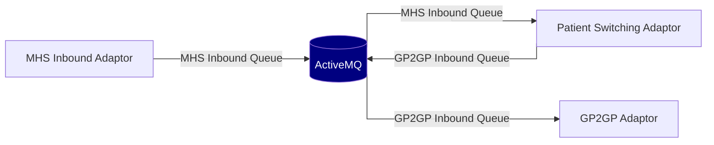

# Operating The Patient Switching Adaptor

## Logging and tracing

The Patient Switching Adaptors services emit logs which are captured by the docker containers they are hosted within. Whichever Docker container orchestration technology is used, the log streams can be captured and forwarded to an appropriate log indexing service for consumption, storage and subsequent queries. 

The consumption of these logs form an essential part of issue investigation and resolution. 

The log messages relating to a specific transfer can be identified by the Conversation ID. Which is a correlating ID present throughout the patient record migration and carried in the GP2GP messages themselves.

### Log message format

```text
yyyy-mm-dd HH:mm:ss.SSS Level=DEBUG Logger=u.n.a.p.t.s.BundleMapperService ConversationId=6836FD37-B856-4167-A087-7E3989020FA3 Thread="org.springframework.jms.JmsListenerEndpointContainer#0-1" Message="Mapped Bundle with [261] entries"
```
- Level: The logging level of the message (INFO/DEBUG/WARN/ERROR) 
- Logger: The name of the Java class that emitted the message
- ConversationId: The ID correlating all messages for a patient transfer
- Message: The log message 

## Timeout functionality

## Database requirements

* The adaptor requires a [PostgreSQL] database
* The adaptor stores the identifiers, status, and metadata for each patient transfer
* The adaptor uses the database as a source of SNOMED information
* Deleting the database, or its records will cause any in-progress transfers to fail
* In addition to the [/Patient/$gpc.migratestructuredrecord][migratestructuredrecord] endpoint, the database can be used to monitor for any failed or incomplete transfers

[PostgreSQL]: https://www.postgresql.org/
[migratestructuredrecord]: README.md#patientgpcmigratestructuredrecord

### Updating the application schema

The adaptor uses Liquibase to perform DB migrations.
New versions of the Adaptor may require DB changes, which will necessitate the execution of the migration script before the new version of the application can be executed.

The DB migrations is build as a Docker image, hosted on DockerHub under [nhsdev/nia-ps-db-migration](https://hub.docker.com/r/nhsdev/nia-ps-db-migration).

Required environment variables:

- POSTGRES_PASSWORD e.g. super5ecret
- PS_DB_OWNER_NAME e.g. postgres
- PS_DB_URL e.g. jdbc:postgresql://hostname:port
- GPC_FACADE_USER_DB_PASSWORD e.g. another5ecret, used when creating the user `gpc_user`
- GP2GP_TRANSLATOR_USER_DB_PASSWORD e.g. yetanother5ecret, used when creating the user `gp2gp_user`

*When passing passwords into this script it is the responsibility of the supplier to ensure that passwords are being kept secure by using appropriate controls within their infrastructure.*

### Updating the SNOMED Database

The adaptor requires an up to date copy of the SNOMED DB as part of translating FHIR `CodableConcepts`.

The SNOMED loader script is built as a Docker image, hosted on DockerHub under [nhsdev/nia-ps-snomed-schema](https://hub.docker.com/r/nhsdev/nia-ps-snomed-schema).

Running the loader script will delete any existing SNOMED data, and then proceed to populate it using the provided extract.

Required environment variables:

- PS_DB_OWNER_NAME e.g. postgres
- POSTGRES_PASSWORD e.g. super5ecret
- PS_DB_HOST e.g. hostname.domain.com
- PS_DB_PORT e.g. 5432

The docker container has a required argument which is the path to a zipped SnomedCT RF2 file.
The container does not come bundled with any Snomed data itself.
You will need to provide this file to the container.

*When passing passwords into this script it is the responsibility of the supplier to ensure that passwords are being kept secure by using appropriate controls within their infrastructure.*

Example usage:
```sh
$ docker run --rm -e PS_DB_OWNER_NAME=postgres -e POSTGRES_PASSWORD=super5ecret -e PS_DB_HOST=postgres -e PS_DB_PORT=5432 \
    -v /path/to/uk_sct2mo_36.3.0_20230705000001Z.zip:/snomed/uk_sct2mo_36.3.0_20230705000001Z.zip \
    nhsdev/nia-ps-snomed-schema /snomed/uk_sct2mo_36.3.0_20230705000001Z.zip
```

## Message broker

### PS Queue

The patient switching service uses a queue for communication between the HTTP facade, and GP2GP translator.

### MHS incoming message flows diagram

The MHS Inbound adaptor accepts incoming HTTPS spine messages, and pushes them onto ActiveMQ.



The set up shown above is described as the daisy-chaining configuration.
In this mode, the PS Adaptor and [GP2GP Adaptor] execute against a single instance of the MHS Adaptor.
Messages received by the PS Adaptor with a conversation ID it doesn't recognise are forwarded to the GP2GP Adaptor queue.

When the daisy-chaining configuration is disabled, the adaptor will put messages it doesn't recognise into the dead letter queue.

In the diagram above there is a single broker for all queues, but the adaptor supports having separate brokers for each queue.

[GP2GP Adaptor]: https://github.com/nhsconnect/integration-adaptor-gp2gp

Required environment variables:

- `PS_AMQP_BROKER`: the location of the PS Adaptors queue. This should be set to the url of a single JMS broker
  (the PS Adaptor does not support concurrent PS Adaptor brokers) - default = `amqp://localhost:5672`
- `PS_AMQP_USERNAME`: The username for accessing the PS broker
- `PS_AMQP_PASSWORD`: The password for accessing the PS broker
- `MHS_AMQP_BROKER`: the location of the MHS Adaptors inbound queue. This should be set to the url of a single JMS broker
  (the PS Adaptor does not support concurrent MHS Adaptor brokers) - default = `amqp://localhost:5672`
- `MHS_AMQP_USERNAME`: The username for accessing the MHS broker
- `MHS_AMQP_PASSWORD`: The password for accessing the MHS broker

Optional environment variables:

- `PS_DAISY_CHAINING_ACTIVE`: set to `true` to enable daisy-chaining - default = `false`
- `PS_QUEUE_NAME`: The name of the PS queue, default = `pssQueue`
- `PS_AMQP_MAX_REDELIVERIES`: default = `3`
- `MHS_QUEUE_NAME`: The name of the MHS Adaptors inbound queue, default = `mhsQueue`
- `MHS_AMQP_MAX_REDELIVERIES`: default = `3`
- `MHS_DLQ_PREFIX`: default = `DLQ.`
- `GP2GP_AMQP_BROKERS`: the location of the GP2GP Adaptors inbound queue. This should be set to the url of a single JMS broker
  (the PS Adaptor does not support concurrent GP2GP Adaptor brokers) - default = `amqp://localhost:5672`
- `GP2GP_MHS_INBOUND_QUEUE`: The name of the GP2GP Adaptors inbound queue, default = `gp2gpInboundQueue`
- `GP2GP_AMQP_USERNAME`: The username for accessing the GP2GP broker
- `GP2GP_AMQP_PASSWORD`: The password for accessing the GP2GP broker

An example daisy chaining environment is provided in [/test-suite/daisy-chaining/](/test-suite/daisy-chaining/).

### Broker Requirements

* The broker must be configured with a limited number of retries and dead-letter queues
* It is the responsibility of the GP supplier to configure adequate monitoring against the dead-letter queues that allows ALL undeliverable messages to be investigated fully.
* The broker must use persistent queues to avoid loss of data
* The Adaptor has been assured against ActiveMQ, the use of other MQ implementations is the responsibility of the GP supplier to test

**Using AmazonMQ**

* A persistent broker (not in-memory) must be used to avoid data loss.
* A configuration profile that includes settings for [retry and dead-lettering](https://activemq.apache.org/message-redelivery-and-dlq-handling.html) and placing non persistent messages onto the dead letter queue must be applied.
* AmazonMQ uses the scheme `amqp+ssl://` but this **MUST** be changed to `amqps://` when configuring the adaptor.

**Using Azure Service Bus**

* The ASB must use [MaxDeliveryCount and dead-lettering](https://docs.microsoft.com/en-us/azure/service-bus-messaging/service-bus-dead-letter-queues#exceeding-maxdeliverycount)
* Azure Service Bus may require some parameters as part of the URL configuration. For example: `PS_AMQP_BROKER=amqps://<NAME>.servicebus.windows.net/;SharedAccessKeyName=<KEY NAME>;SharedAccessKey=<KEY VALUE>`

## Object storage
Data stored:
    EhrExtract attachments of MHS Inbound, pre-signed S3 url is generated for stored attachments      
Filename convention:
    Attachment files are named as {conversationId}_{documentId} where documentId is the name of the file which includes an extension.
    ConversationId - Task conversation ID
Configuration:
    The app uses a number of attempts to upload attachments. It is configured in retry policy. 
    Generated stored attachments will be available for 60 min to be downloaded, after this time limit the download link will be invalidated
    although no files will be deleted from S3 bucket.

## AWS daisy chaining example

## Environment variables


